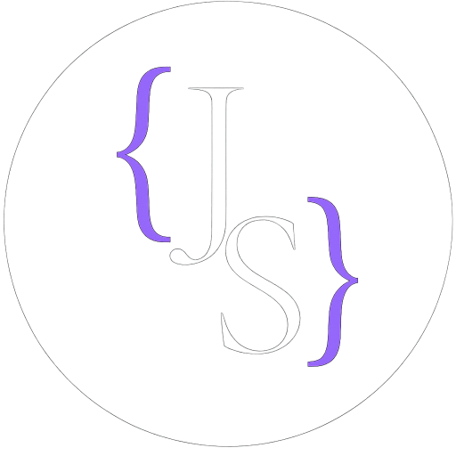

<p align="center"></p>

<h1 align="center">My Website & Blog</h1>
<div align="center"> 
  <!-- MIT License -->
  <a href="./LICENSE-MIT">
    
  </a>
  <!-- CC License -->
  <a href="./LICENSE-CC-BY-NC">
    
  </a>
  <!-- Blog Health -->
  <a href="https://josimar-silva.com/">
    
  </a>
  <!-- Blog uptime -->
  <a href="https://josimar-silva.com/">
    
  </a>
  <!-- Blog Response Time -->
  <a href="https://josimar-silva.com/">
    
  </a>
  <!-- Sonar Quality Gate -->
  <a href="https://sonarcloud.io/summary/new_code?id=josimar-silva_blog">
    
  </a>
  <!-- Sonar Coverage -->
  <a href="https://sonarcloud.io/summary/new_code?id=josimar-silva_blog">
    
  </a>
  <!-- OSSF Score Card -->
  <a href="https://scorecard.dev/viewer/?uri=github.com/josimar-silva/blog">
    
  </a>
  <!-- CodeQL Advanced -->
  <a href="https://github.com/josimar-silva/blog/actions/workflows/codeql.yaml">
    
  </a>
  <!-- Spell check -->
  <a href="https://github.com/josimar-silva/blog/actions/workflows/spellcheck.yaml">
    
  </a>
  <!-- Docker Builds -->
  <a href="https://github.com/josimar-silva/blog/actions/workflows/docker.yaml">
    
  </a>
  <!-- CI -->
  <a href="https://github.com/josimar-silva/blog/actions/workflows/ci.yaml">
    
  </a>
  <!-- CD -->
  <a href="https://github.com/josimar-silva/blog/actions/workflows/cd.yaml">
    
  </a>
</div>
<div align="center">
  <strong>Personal website and blog</strong>
</div>

<div align="center">
  A place to gather my thoughts on Software Engineering, homelab experiments and more.
</div>

<div align="center">
  <sub>Built with <i>viele</i> ☕️ by
  <a href="https://josimar-silva.com">Josimar Silva</a>.
</div>

## 📖 Table of Contents

- [📝 Introduction](#-introduction)
- [🏁 Getting Started](#-getting-started)
- [🛠️ Available Scripts](#️-available-scripts)
- [🧪 Testing](#-testing)
- [🚢 Releasing](#-releasing)
- [🤝 Contributing](#-contributing)
- [📄 License](#-license)

## 📝 Introduction

This is a personal website and blog built with [Next.js](https://nextjs.org/), [TypeScript](https://www.typescriptlang.org/), and [Markdown](https://www.markdownguide.org/). 

It serves as a platform for sharing thoughts on software engineering, homelab experiments, and other technical topics.

**Key Features:**
- Static site generation with Next.js for optimal performance and SEO
- Type-safe development with TypeScript
- Markdown-based content management for blog posts and book reviews
- Comprehensive test coverage with Jest and Playwright
- Responsive design with Tailwind CSS
- Progressive Web App (PWA) support
- High code quality standards with ESLint and SonarCloud
- Automated CI/CD pipeline with GitHub Actions

## 🏁 Getting Started

Follow these instructions to get the project running on your local machine.

### Prerequisites

- [Node.js](https://nodejs.org/) (v24.x or later)

### Installation

1.  Clone the repository.
2.  Navigate to the `blog` directory:
    ```bash
    cd website
    ```
3.  Install the dependencies using `npm`:
    ```bash
    npm install
    ```

    Alternatively, you can use the `just` command:
    ```bash
    just install
    ```

### Running the Development Server

To start the development server, run:

```bash
just dev
```

The application will be available at [http://localhost:3000](http://localhost:3000).

## 🛠️ Available Scripts

This project uses `just` as a command runner for convenience.

- `just dev`: Starts the development server with Turbopack.
- `just build`: Builds the application for production.
- `just start`: Starts the production server (requires a build first).
- `just check`: Runs both linting and formatting checks.
- `just lint`: Lints the codebase using ESLint.
- `just format`: Formats the code using Prettier and fixes linting issues.
- `just test`: Runs all unit tests with Jest.
- `just test-e2e`: Builds the app and runs all end-to-end tests with Playwright.

## 🧪 Testing

The project includes both unit and end-to-end tests.

- **Unit Tests**: Run all unit tests using Jest:
  ```bash
  just test
  ```
- **End-to-End Tests**: Run all E2E tests using Playwright. This command will first build the application and then run the tests against the production build.
  ```bash
  just test-e2e
  ```

## 🚢 Releasing

Check the [Releasing](./RELEASING.md) documentation for information about releasing to Cloudflare Pages.

## 🤝 Contributing

We welcome contributions to the blog project! If you're interested in contributing, enhancing the frontend, adding new features, or writing guess blog posts please see our [Contributing Guidelines](./CONTRIBUTING.md) for more information.

## 📄 License
Copyright (C) 2025 Josimar Silva

Unless otherwise specified:

*   **Source Code:** This project's code is licensed under the [MIT License](https://opensource.org/licenses/MIT).
*   **Content:** All content, including blog posts (`__posts/`), book reviews, and similar creative works, is licensed under the [Creative Commons Attribution-Non Commercial 4.0 International (CC BY-NC 4.0) License](https://creativecommons.org/licenses/by-nc/4.0/).

